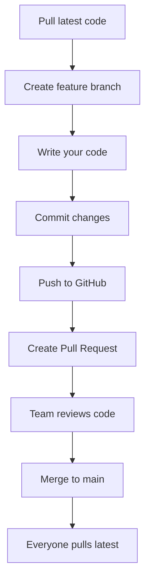

# AI Discovery — Complete Deployment & Team Guide

## Your Project Structure After Changes

```
AI-Discovery/
├── backend/               ← Deploy this to Render.com
│   ├── main.py            ← FastAPI server (auto-preloads 100 repos on start)
│   ├── datafetcher.py     ← Parallel GitHub API fetcher  
│   ├── scoring.py         ← AI tool scoring algorithm
│   ├── cache_manager.py   ← In-memory + file cache
│   ├── database.py        ← Supabase integration
│   ├── requirements.txt   ← Python dependencies
│   ├── render.yaml        ← Render configuration
│   ├── Procfile            ← Render start command
│   └── .env               ← Environment variables (DO NOT COMMIT!)
│
├── frontend/              ← Deploy this to Vercel
│   ├── index.html         ← Homepage
│   ├── rankings.html      ← Rankings page
│   ├── compare.html       ← Compare tools
│   ├── search.html        ← Search page
│   ├── tool.html          ← Tool detail page
│   ├── login.html         ← Login page
│   └── vercel.json        ← Vercel configuration
│
└── TEAM_GUIDE.md          ← This file
```

---

## Part 1: Running Backend Locally

```bash
# 1. Go to backend folder
cd backend

# 2. Create virtual environment (first time only)
python -m venv venv
venv\Scripts\activate       # Windows

# 3. Install dependencies (first time only)
pip install -r requirements.txt

# 4. Create .env file with your keys
# GITHUB_TOKEN=ghp_your_token_here
# SUPABASE_URL=https://your-project.supabase.co
# SUPABASE_KEY=your_supabase_key

# 5. Run the server
python main.py
```

The server will:
- Start at `http://localhost:8000`
- Automatically fetch 100 AI repos in ~5-10 seconds
- Cache everything in memory
- All API calls will be INSTANT after that

**Test it:** Open `http://localhost:8000/docs` in your browser — you'll see all endpoints.

---

## Part 2: Deploying Backend to Render.com

### Step-by-Step

1. **Push your code to GitHub** (if not already done)

2. **Go to [render.com](https://render.com)** → Sign up/Login

3. **Click "New +" → "Web Service"**

4. **Connect your GitHub repo** `AI-Discovery`

5. **Fill in these settings:**

   | Setting | Value |
   |---------|-------|
   | **Name** | `ai-tool-discovery-api` |
   | **Region** | Choose closest to you (e.g., Singapore/Oregon) |
   | **Branch** | `main` |
   | **Root Directory** | `backend` |
   | **Runtime** | `Python 3` |
   | **Build Command** | `pip install -r requirements.txt` |
   | **Start Command** | `uvicorn main:app --host 0.0.0.0 --port $PORT` |
   | **Instance Type** | Free |

6. **Add Environment Variables** (click "Advanced" → "Add Environment Variable"):

   | Key | Value |
   |-----|-------|
   | `GITHUB_TOKEN` | Your GitHub Personal Access Token |
   | `SUPABASE_URL` | Your Supabase project URL |
   | `SUPABASE_KEY` | Your Supabase anon/service key |
   | `PYTHON_VERSION` | `3.11.0` |

7. **Click "Create Web Service"**

8. **Wait 3-5 minutes** for the build to finish

9. **Your API URL will be:** `https://ai-tool-discovery-api.onrender.com`

### Why Render Wasn't Working Before

The most common reasons your Render deployment failed to fetch data:

1. **Missing `GITHUB_TOKEN`** — Without this, GitHub API rate limits you to 10 requests/hour
2. **Missing `Root Directory`** — You must set it to `backend` since your Python files are in the `backend/` folder
3. **Wrong Start Command** — Must be `uvicorn main:app --host 0.0.0.0 --port $PORT` (using `$PORT` not `8000`)
4. **Missing CORS** — Now fixed in the updated `main.py`

### How to Verify Render is Working

After deploying, visit these URLs:
- `https://YOUR-APP.onrender.com/` → Should show health check JSON
- `https://YOUR-APP.onrender.com/api/rankings` → Should show ranked AI tools
- `https://YOUR-APP.onrender.com/docs` → Should show FastAPI documentation

> ⚠️ **Note:** Render free tier sleeps after 15 min of inactivity. First request after sleep takes ~30 seconds.

---

## Part 3: Deploying Frontend to Vercel

### Step-by-Step

1. **First, update `API_URL` in all frontend HTML files:**
   
   Open each file in `frontend/` and change:
   ```javascript
   // CHANGE THIS to your Render.com URL:
   const API_URL = 'https://ai-tool-discovery-api.onrender.com';
   ```

2. **Go to [vercel.com](https://vercel.com)** → Sign up with GitHub

3. **Click "Add New Project"**

4. **Import your GitHub repo** `AI-Discovery`

5. **Fill in these settings:**

   | Setting | Value |
   |---------|-------|
   | **Root Directory** | `frontend` |
   | **Framework Preset** | `Other` |
   | **Build Command** | *(leave empty)* |
   | **Output Directory** | `.` |

6. **Click "Deploy"**

7. **Your frontend URL will be:** `https://ai-discovery.vercel.app` (or similar)

---

## Part 4: GitHub Team Collaboration (4 Members)

### Initial Setup (Each Member Does This Once)

```bash
# 1. Clone the repo
git clone https://github.com/YOUR-USERNAME/AI-Discovery.git
cd AI-Discovery

# 2. Create your .env file in backend/ (each member needs their own)
# Copy from the template above
```

### Daily Workflow



### Step-by-Step: How to Work on a Feature

```bash
# 1. ALWAYS start by pulling the latest code
git checkout main
git pull origin main

# 2. Create a new branch for your feature
git checkout -b feature/your-feature-name
# Examples:
# git checkout -b feature/3d-homepage
# git checkout -b feature/search-filters
# git checkout -b fix/ranking-bug

# 3. Make your changes (write code, add files, etc.)

# 4. Stage your changes
git add .

# 5. Commit with a clear message
git commit -m "Add: description of what you did"

# 6. Push your branch to GitHub
git push origin feature/your-feature-name
```

### Step-by-Step: Creating a Pull Request (PR)

1. Go to your repo on **github.com**
2. You'll see a yellow banner: **"your-branch had recent pushes"** → Click **"Compare & pull request"**
3. Fill in:
   - **Title:** Clear description (e.g., "Add 3D homepage design")
   - **Description:** What you changed and why
4. Click **"Create pull request"**
5. **Assign reviewers** (your teammates)
6. Wait for at least **1 approval** before merging

### Step-by-Step: Reviewing a Pull Request

1. Go to the **Pull Requests** tab on GitHub
2. Click on a teammate's PR
3. Click **"Files changed"** tab to see the code
4. Leave comments on specific lines if needed
5. Click **"Review changes"** → Choose:
   - ✅ **Approve** — Looks good!
   - 💬 **Comment** — Just a question/suggestion
   - ❌ **Request changes** — Needs fixes
6. After approval, the PR author clicks **"Merge pull request"**

### After a PR is Merged

```bash
# Everyone should run this to get the latest code:
git checkout main
git pull origin main
```

### Suggested Team Roles

| Member | Focus Area | Branch Prefix |
|--------|-----------|---------------|
| **Member 1** | Backend API & data fetching | `feature/backend-*` |
| **Member 2** | Frontend UI & design | `feature/frontend-*` |
| **Member 3** | Scoring algorithm & database | `feature/scoring-*` |
| **Member 4** | Testing, deployment & docs | `feature/deploy-*` |

### Handling Merge Conflicts

If you get a conflict when merging:

```bash
# 1. Pull latest main into your branch
git checkout your-branch
git pull origin main

# 2. Git will show conflicted files — open them and look for:
# <<<<<<< HEAD
# (your version)
# =======
# (their version)
# >>>>>>> main

# 3. Edit the file to keep what you want, remove the markers

# 4. Stage and commit
git add .
git commit -m "Resolve merge conflict"
git push origin your-branch
```

### Branch Naming Convention

```
feature/short-description    → New features
fix/bug-description          → Bug fixes
improve/what-improved        → Improvements
docs/what-documented         → Documentation
```

---

## Quick Reference Card

### Run Locally
```bash
cd backend && python main.py          # Start backend
# Open frontend/index.html in browser  # Start frontend
```

### Deploy
```
Backend → Render.com (Root: backend/)
Frontend → Vercel (Root: frontend/)
```

### Git Workflow
```bash
git pull origin main                   # Get latest
git checkout -b feature/my-feature     # New branch
# ... make changes ...
git add . && git commit -m "message"   # Save
git push origin feature/my-feature     # Upload
# → Create PR on GitHub → Get review → Merge
```
